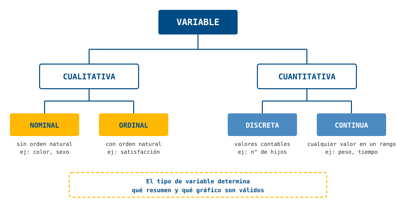
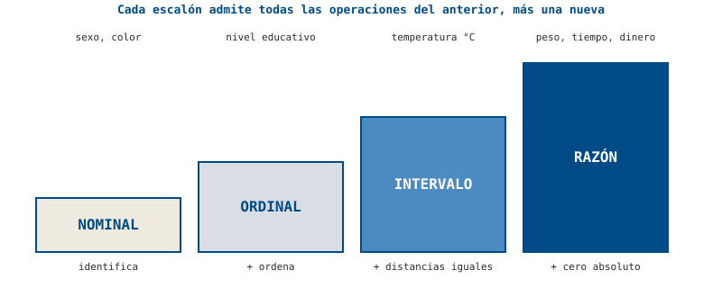

::: {.hero-motivacion}
## 🎬 ¿Cómo sabe Netflix qué recomendarte?

No le pregunta a sus 260 millones de usuarios. Usa los datos de una muestra: género, calificación, minutos vistos, si terminaste la serie o no. Pero esas variables no son todas iguales entre sí.
:::

::: {.ficha-prediccion}
Antes de seguir: de estas cuatro variables — género, calificación en estrellas, minutos vistos, país del usuario — ¿cuáles crees que se pueden "promediar" con sentido y cuáles no? Anótalo.
:::

## 🔬 Exploremos

Vamos a clasificar variables reales de un conjunto de datos de mamíferos y su sueño (`msleep`, incluido en `ggplot2`), **sin definiciones todavía**. Solo con tu intuición.

```{r}
library(ggplot2)
head(msleep[, c("name", "vore", "order", "conservation",
                "sleep_total", "sleep_rem", "bodywt")])
```

::: {.ficha-resultado}
En grupos, separen estas variables en dos montones: "se puede promediar directamente" vs. "no tiene sentido promediarla". Dentro del segundo montón, ¿alguna tiene un orden natural?
:::

::: {.callout-tip}
## Pregunta guía
¿Qué pasaría si calculas el "promedio" del nombre de los animales? ¿Y el "promedio" del estado de conservación?
:::

## 🎛️ Practica la clasificación

Elige una variable, decide su tipo, y compara tu respuesta contra la clasificación correcta.

```{r}
#| label: fig-tipos-variable
#| fig-cap: "Variables de msleep clasificadas por tipo"
library(plotly)
library(ggplot2)

clasificacion <- data.frame(
  tipo = c("Nominal", "Ordinal", "Discreta", "Continua"),
  cantidad = c(4, 1, 1, 5)  # ajustar según las 11 columnas reales de msleep
)

p <- ggplot(clasificacion, aes(x = tipo, y = cantidad, fill = tipo)) +
  geom_col() +
  scale_fill_manual(values = c("Nominal" = "#004B85", "Ordinal" = "#4B8BC2",
                                "Discreta" = "#FFB903", "Continua" = "#D9DEE4")) +
  labs(x = NULL, y = "Número de variables") +
  theme_minimal(base_family = "IBM Plex Mono") +
  theme(legend.position = "none")

ggplotly(p)
```

::: {.callout-note}
## Lo que deberías notar
La mayoría de las variables "obvias" (nombre, peso) se clasifican fácil. Las que generan discusión —como el estado de conservación— son las que mejor enseñan la diferencia entre nominal y ordinal.
:::

## 💡 Discusión

- ¿Qué variable les costó más clasificar? ¿Por qué?
- ¿Coincidió su clasificación grupal con la de sus compañeros?
- ¿Por qué esto importa antes de graficar o resumir datos (temas siguientes)?

## 📖 Ahora sí, la teoría

### El árbol de las variables

Toda variable se clasifica primero en cualitativa o cuantitativa, y dentro de cada rama, en dos subtipos más:



::: {.panel-tabset}

## Población y muestra
**Población:** el conjunto completo de individuos, objetos o eventos de los cuales nos interesa estudiar alguna característica (Rincón, 2017). Debe especificarse con la mayor precisión posible: no es lo mismo "estudiantes universitarios" que "estudiantes de pregrado matriculados en 2026-2".

**Muestra:** un subconjunto de la población, seleccionado para el análisis porque estudiar la población completa suele ser costoso, lento o imposible.

**Unidad de observación (o unidad experimental):** el objeto o individuo específico del cual se toma cada medición — un estudiante, un producto fabricado, un animal.

## Cualitativa nominal
Variable que clasifica en categorías **sin ningún orden natural entre ellas** — son etiquetas puras. Ejemplos: sexo, tipo de sangre (A, B, AB, O), estado civil. No tiene sentido preguntar "¿cuál categoría es mayor?".

## Cualitativa ordinal
Variable que clasifica en categorías **con un orden o jerarquía implícita**, pero sin que la distancia entre categorías esté definida numéricamente. Ejemplos: nivel educativo, calificación (excelente/bueno/malo), rango militar. Sí tiene sentido decir "excelente es mejor que bueno", pero no "cuánto mejor" en términos numéricos exactos.

## Cuantitativa discreta
Variable numérica cuyos valores son **contables**, generalmente resultado de un conteo, con "huecos" o brechas entre valores posibles (0, 1, 2, 3...). Ejemplos: número de hijos en una familia, número de defectos en un lote.

## Cuantitativa continua
Variable numérica que puede tomar **cualquier valor dentro de un intervalo**, sin huecos entre valores posibles, resultado típicamente de una medición. Ejemplos: peso, tiempo, temperatura. Esta es la razón por la que, como veremos en el Tema 3, no se puede tabular "un valor a la vez": hay que agrupar en intervalos.

:::

### Escalas de medición

Independientemente de si una variable es cualitativa o cuantitativa, también se clasifica según qué **operaciones matemáticas tienen sentido** sobre ella. Son 4 escalas, cada una más "permisiva" que la anterior:



- **Nominal:** solo permite identificar y contar categorías (no se puede ordenar).
- **Ordinal:** permite además ordenar, pero no restar (no sabemos "cuánto" separa a dos niveles).
- **De intervalo:** permite además restar (las distancias son iguales), pero no existe un cero absoluto — por eso 20°C no es "el doble de caliente" que 10°C.
- **De razón:** permite además dividir y hablar de proporciones, porque existe un cero absoluto real — 20 kg sí es el doble de 10 kg.

::: {.callout-tip}
## 💡 Truco de interpretación
Antes de analizar cualquier dataset nuevo, corre primero `str()` o `glimpse()` y clasifica cada columna a mano. Un error clásico es tratar un código numérico (código postal, número de identificación) como si fuera cuantitativo solo porque R lo guarda como número — el tipo de dato en R no siempre coincide con el tipo estadístico real de la variable. [Ver más trucos →](../recursos.qmd)
:::

## 🧪 Ejemplo con datos reales

**Paso 1 — Ver el tipo de dato que R asigna a cada columna:**
```{r}
library(dplyr)
glimpse(msleep)
```

**Paso 2 — Tabla de frecuencias de la variable `vore` (tipo de dieta):**
```{r}
table(msleep$vore)
```

Contrasta lo que R llama `chr`, `num`, `int`, `factor` con la clasificación estadística que acabas de construir — no siempre coinciden.

### Otro ejemplo: clasificar 5 variables de un dataset de hábitos

Un dataset de hábitos de TV/streaming trae las variables `id`, `Tv Source` (plataforma), `Hours per week`, `Binge Frequency` (frecuencia con la que se ve "en maratón": nunca/a veces/siempre) y `Sex`. Antes de graficar nada, clasifícalas:

| Variable | Tipo |
|---|---|
| `id` | Cualitativa nominal (es un identificador, no tiene sentido "promediarlo") |
| `Tv Source` | Cualitativa nominal (no hay orden entre plataformas) |
| `Hours per week` | Cuantitativa continua / de razón |
| `Binge Frequency` | Cualitativa **ordinal** (nunca < a veces < siempre — sí hay orden) |
| `Sex` | Cualitativa nominal (caso particular: binaria) |

::: {.callout-note}
## Lo que deberías notar
`Tv Source` y `Sex` son ambas nominales, pero por razones distintas: `Sex` es nominal *porque* solo tiene dos categorías sin orden (binaria), mientras que `Tv Source` podría tener muchas categorías (Netflix, HBO, Disney+, ...) y sigue sin haber un orden natural entre ellas. "Binaria" describe cuántas categorías tiene una variable; "nominal vs. ordinal" describe si esas categorías tienen orden — son dos preguntas distintas que pueden combinarse.
:::

Una vez clasificadas, `Hours per week` (continua) se puede **recodificar** en una variable categórica binaria — la misma idea que ya viste con el índice de masa corporal (IMC) al clasificarlo en "Saludable"/"No saludable": aquí, un umbral de 20 horas/semana separa "riesgo" de "no riesgo".

```{r}
horas <- c(5, 22, 18, 30, 12, 25, 8, 40)

riesgo <- ifelse(horas >= 20, 1, 0)
riesgo_label <- factor(riesgo, levels = c(0, 1), labels = c("no", "yes"))

table(riesgo_label)
```

::: {.callout-tip}
## 💡 Truco de interpretación
Recodificar una variable continua en categórica (como aquí, o como el IMC en "Saludable"/"No saludable") **siempre pierde información** — dos personas con 21 y 39 horas/semana quedan en la misma categoría "riesgo", aunque su situación real sea muy distinta. Tiene sentido hacerlo cuando el umbral tiene un significado clínico o práctico claro (aquí, un punto de corte de riesgo), no solo por comodidad para graficar. [Ver más trucos →](../recursos.qmd)
:::

## 🧑‍🔬 Laboratorio

Con el dataset `starwars` (incluido en `dplyr`), clasifica `species`, `eye_color`, `height`, `mass` y `gender`:

1. ¿Cuáles son cualitativas y cuáles cuantitativas?
2. De las cualitativas, ¿cuáles son ordinales y cuáles nominales?
3. De las cuantitativas, ¿son de intervalo o de razón? Justifica con el criterio del "cero absoluto".

## ✅ Ejercicios autocorregibles

### Ejercicio 1 — Completa el código

Copia esto en tu propia sesión de RStudio y complétalo (reemplaza `___`):

```r
# ¿Qué tipo de dato le asigna R a la variable msleep$vore?
# Completa con la función correcta:
___(msleep$vore)
```

<details>
<summary>Ver respuesta</summary>
`class(msleep$vore)` — devuelve `"character"`. Es la misma función que usaste en la exploración del tema para ver `chr`, `num`, `int`, `factor` por columna, ahora aplicada a una sola columna.
</details>

### Ejercicio 2 — Verdadero o falso

<div class="card-lab" id="quiz-tema1">
<div style="margin-bottom: 1rem;">
  <strong>1. Toda variable numérica es de escala de razón.</strong><br>
  <label><input type="radio" name="q1" value="V"> Verdadero</label>
  <label style="margin-left: 1rem;"><input type="radio" name="q1" value="F"> Falso</label>
</div>
<div style="margin-bottom: 1rem;">
  <strong>2. El código postal de una dirección es una variable cuantitativa porque R lo puede guardar como número.</strong><br>
  <label><input type="radio" name="q2" value="V"> Verdadero</label>
  <label style="margin-left: 1rem;"><input type="radio" name="q2" value="F"> Falso</label>
</div>
<div style="margin-bottom: 1rem;">
  <strong>3. El estado de conservación de un animal (least concern, vulnerable, endangered...) es una variable ordinal.</strong><br>
  <label><input type="radio" name="q3" value="V"> Verdadero</label>
  <label style="margin-left: 1rem;"><input type="radio" name="q3" value="F"> Falso</label>
</div>
<button class="btn-outline-prediccion" style="padding: 0.5rem 1rem; border-radius: 4px; cursor: pointer;" onclick="revisarQuizTema1()">Revisar respuestas</button>
<p id="resultado-quiz-tema1" style="margin-top: 1rem; font-weight: 700;"></p>
</div>

<script>
function revisarQuizTema1() {
  const respuestas = { q1: "F", q2: "F", q3: "V" };
  // Exigir que todas las preguntas estén respondidas antes de revelar el resultado
  const sinResponder = Object.keys(respuestas).filter(
    p => !document.querySelector(`input[name="${p}"]:checked`)
  );
  const resultadoEl = document.getElementById("resultado-quiz-tema1");
  if (sinResponder.length > 0) {
    resultadoEl.textContent = "Responde todas las preguntas antes de revisar.";
    resultadoEl.style.color = "#B37D00";
    return;
  }
  let correctas = 0;
  let total = Object.keys(respuestas).length;
  for (const [pregunta, correcta] of Object.entries(respuestas)) {
    const seleccionado = document.querySelector(`input[name="${pregunta}"]:checked`);
    if (seleccionado && seleccionado.value === correcta) correctas++;
  }
  const resultado = document.getElementById("resultado-quiz-tema1");
  resultado.textContent = `Obtuviste ${correctas} de ${total} correctas.`;
  resultado.style.color = correctas === total ? "#004B85" : "#B37D00";
  document.getElementById("explicacion-quiz-tema1").style.display = "block";
}
</script>

<div id="explicacion-quiz-tema1" style="display: none;" class="card-lab">
<strong>Explicación de las respuestas</strong>
<ol>
<li><strong>Falso</strong> — la temperatura en °C es numérica pero de intervalo, no de razón.</li>
<li><strong>Falso</strong> — es el error clásico del Tema 1: el tipo de dato en R no determina la escala estadística.</li>
<li><strong>Verdadero</strong> — tiene un orden natural de severidad, aunque no una distancia numérica definida entre niveles.</li>
</ol>
</div>

## 🗂️ Resumen

::: {.card-lab}
- No todos los datos son iguales: primero se clasifica, después se resume o grafica.
- El tipo de dato que usa R (`num`, `chr`, `int`) no siempre coincide con la clasificación estadística.
- Cualitativa (nominal/ordinal) vs. cuantitativa (discreta/continua) determina qué gráfico y qué resumen tienen sentido — eso es justo lo que viene en los próximos temas.
:::
