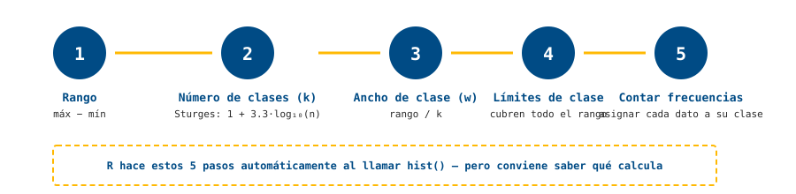

::: {.hero-motivacion}
## 🌋 ¿Qué tan "fiel" es Old Faithful?

El géiser Old Faithful (Yellowstone) es famoso por ser predecible. Si midieras la duración de 272 erupciones, ¿esperarías una sola forma de campana, o podría haber algo más raro escondido en los datos?
:::

::: {.ficha-prediccion}
Antes de seguir: dibuja (mentalmente o en papel) la forma que crees que tendría el histograma de duraciones. ¿Una sola montaña? ¿Dos?
:::

## 🔬 Exploremos: cuando "una fila por valor" deja de funcionar

En la Clase 2 hicimos tablas de frecuencia con una fila por categoría. Prueba hacer lo mismo con estos 20 tiempos (en minutos):

```
1.75, 3.10, 4.20, 1.95, 4.35, 3.87, 1.83, 4.42, 3.55, 1.60,
4.10, 2.05, 3.92, 1.88, 4.28, 3.63, 2.15, 4.05, 1.72, 3.78
```

::: {.ficha-resultado}
¿Cuántas filas tendría tu tabla si haces una por valor distinto? ¿Sigue resumiendo algo, o casi tienes tantas filas como datos?
:::

::: {.callout-tip}
## Pregunta guía
¿Cómo agruparías estos 20 valores en solo 4 o 5 intervalos, sin que nadie te lo indique?
:::

## 🎛️ Simulación: ¿cuántos intervalos usar?

Mueve el número de intervalos del histograma de `faithful$eruptions` (272 erupciones reales del géiser, dataset incluido en R) y observa qué aparece — y qué desaparece.

```{r}
#| label: fig-histograma-sturges
#| fig-cap: "Duración de erupciones de Old Faithful — pocos vs. muchos intervalos"
#| layout-ncol: 2
data(faithful)

hist(faithful$eruptions, breaks = 3, col = "#004B85", border = "white",
     main = "breaks = 3", xlab = "Duración (min)", ylab = "Frecuencia")

hist(faithful$eruptions, breaks = 30, col = "#004B85", border = "white",
     main = "breaks = 30", xlab = "Duración (min)", ylab = "Frecuencia")
```

::: {.callout-note}
## Lo que deberías notar
Con `breaks = 3` el histograma parece una sola montaña — pero con más intervalos aparecen **dos picos claros**. La duración de las erupciones no es "un solo tipo": hay erupciones cortas y erupciones largas, con pocas intermedias.
:::

## 💡 Discusión

- ¿En qué punto (aproximado) empezaron a verse las dos montañas?
- Si solo te dijeran "la erupción promedio dura 3.5 minutos", ¿qué información importante te estarías perdiendo?
- ¿Qué le dirías a alguien que concluye "el géiser es predecible" mirando solo el promedio?

## 📖 Ahora sí, la teoría

### Cómo se construye una tabla de frecuencias agrupada



::: {.panel-tabset}

## Histograma (Rincón, 2017)
Una gráfica similar a la de barras, pero **sin espacios entre las barras** — porque una variable continua no tiene "huecos" entre categorías: fluye de un valor a otro. Cada barra representa un intervalo (clase), y su altura es la frecuencia (absoluta, relativa o porcentual) de datos que caen en ese intervalo.

## Regla de Sturges
Una guía práctica para elegir cuántos intervalos ($k$) usar al agrupar $n$ observaciones:

$$k = 1 + 3.3 \cdot \log_{10}(n)$$

Con $k$ ya definido, el **ancho de cada clase** se calcula como:

$$w = \frac{\text{rango}}{k} = \frac{\text{máximo} - \text{mínimo}}{k}$$

normalmente redondeado hacia arriba a un número conveniente. No es una ley exacta — es un punto de partida razonable. R usa un algoritmo basado en esta misma idea por defecto en `hist()`, pero permite forzar cualquier valor con el argumento `breaks`.

## Simetría y sesgo
- **Simétrica:** los datos se distribuyen de forma pareja alrededor del centro (forma de campana).
- **Sesgada a la derecha (asimetría positiva):** cola larga hacia valores altos — hay algunos valores mucho más grandes que el resto.
- **Sesgada a la izquierda (asimetría negativa):** cola larga hacia valores bajos.

## Modalidad
- **Unimodal:** un solo pico — la mayoría de los datos se agrupan en torno a un único valor central.
- **Bimodal / multimodal:** dos o más picos — puede sugerir que los datos provienen de dos o más grupos o procesos distintos, mezclados en la misma muestra (como en `faithful$eruptions`).

:::

### Las 4 formas típicas, con datos reales

Cada panel de abajo se genera con datos simulados que siguen exactamente el patrón que describe su nombre — no son dibujos, son histogramas reales de R:

```{r}
#| label: fig-cuatro-formas
#| fig-cap: "Las cuatro formas típicas de una distribución, generadas con datos reales"
set.seed(42)
par(mfrow = c(2, 2), mar = c(3, 3, 3, 1))

# Simétrica
x1 <- rnorm(2000, mean = 50, sd = 10)
hist(x1, breaks = 25, col = "#004B85", border = "white",
     main = "Simétrica", xlab = "", ylab = "")

# Sesgada a la derecha
x2 <- rgamma(2000, shape = 2, rate = 0.1)
hist(x2, breaks = 25, col = "#FFB903", border = "white",
     main = "Sesgada a la derecha", xlab = "", ylab = "")

# Sesgada a la izquierda
x3 <- 100 - rgamma(2000, shape = 2, rate = 0.1)
hist(x3, breaks = 25, col = "#4B8BC2", border = "white",
     main = "Sesgada a la izquierda", xlab = "", ylab = "")

# Bimodal
x4 <- c(rnorm(1000, 30, 5), rnorm(1000, 70, 5))
hist(x4, breaks = 25, col = "#B37D00", border = "white",
     main = "Bimodal", xlab = "", ylab = "")
```

::: {.callout-note}
## Prueba tú mismo
Cambia `shape` o `rate` en `rgamma()`, o las medias en el ejemplo bimodal, y vuelve a correr el chunk. ¿Qué tan sesgada puedes hacer una distribución antes de que dejes de reconocerla como "campana deformada"?
:::

::: {.callout-tip}
## 💡 Truco de interpretación
Si alguien te presenta un histograma sin decir cuántos `breaks` usó, no confíes todavía en su forma. Como viste con Old Faithful, muy pocos intervalos pueden esconder por completo una bimodalidad real. La forma "definitiva" de una distribución solo se puede afirmar después de probar con distintos niveles de agrupamiento. [Ver más trucos →](../recursos.qmd)
:::

## 🧪 Ejemplo con datos reales

**Paso 1 — Calcular $k$ con la regla de Sturges:**
```{r}
n <- nrow(faithful)
n
k <- 1 + 3.3 * log10(n)
k
```

**Paso 2 — Redondear y construir el histograma:**
```{r}
hist(faithful$eruptions, breaks = round(k),
     main = "Duración de erupciones (Sturges)",
     xlab = "Duración (min)", ylab = "Frecuencia",
     col = "#004B85", border = "white")
```

## 🧑‍🔬 Laboratorio

Con `mtcars$mpg` (el mismo dataset del Tema 0):

1. Calcula $k$ con la regla de Sturges para $n = 32$.
2. Construye el histograma con ese $k$, con la mitad y con el doble.
3. Describe la forma en cada caso (simetría, sesgo, modalidad) y decide cuál usarías en un informe.

## ✅ Ejercicios autocorregibles

### Ejercicio 1 — Completa el código

```r
# Regla de Sturges: completa la función correcta
k <- 1 + 3.3 * ___(n)
```

<details>
<summary>Ver respuesta</summary>
`log10(n)` — el logaritmo en base 10 del número de observaciones.
</details>

### Ejercicio 2 — Verdadero o falso

<div class="card-lab" id="quiz-tema3">
<div style="margin-bottom: 1rem;"><strong>1. Un histograma siempre debe tener espacios entre las barras.</strong><br>
<label><input type="radio" name="q1" value="V"> Verdadero</label> <label style="margin-left: 1rem;"><input type="radio" name="q1" value="F"> Falso</label></div>
<div style="margin-bottom: 1rem;"><strong>2. La regla de Sturges da un número exacto y obligatorio de intervalos.</strong><br>
<label><input type="radio" name="q2" value="V"> Verdadero</label> <label style="margin-left: 1rem;"><input type="radio" name="q2" value="F"> Falso</label></div>
<div style="margin-bottom: 1rem;"><strong>3. Una distribución bimodal tiene dos picos.</strong><br>
<label><input type="radio" name="q3" value="V"> Verdadero</label> <label style="margin-left: 1rem;"><input type="radio" name="q3" value="F"> Falso</label></div>
<button class="btn-outline-prediccion" style="padding: 0.5rem 1rem; border-radius: 4px; cursor: pointer;" onclick="revisarQuizTema3()">Revisar respuestas</button>
<p id="resultado-quiz-tema3" style="margin-top: 1rem; font-weight: 700;"></p>
</div>

<script>
function revisarQuizTema3() {
  const respuestas = { q1: "F", q2: "F", q3: "V" };
  let correctas = 0;
  for (const [p, c] of Object.entries(respuestas)) {
    const s = document.querySelector(`input[name="${p}"]:checked`);
    if (s && s.value === c) correctas++;
  }
  const r = document.getElementById("resultado-quiz-tema3");
  r.textContent = `Obtuviste ${correctas} de ${Object.keys(respuestas).length} correctas.`;
  r.style.color = correctas === Object.keys(respuestas).length ? "#004B85" : "#B37D00";
}
</script>

## 🗂️ Resumen

::: {.card-lab}
- Una variable continua se agrupa en intervalos antes de tabular — "una fila por valor" no resume nada.
- La regla de Sturges ($k = 1 + 3.3 \log_{10} n$) da un punto de partida razonable para el número de clases, no una respuesta única.
- Un histograma puede revelar formas (sesgo, bimodalidad) que un solo número como el promedio no muestra — como en el caso real de Old Faithful.
:::
